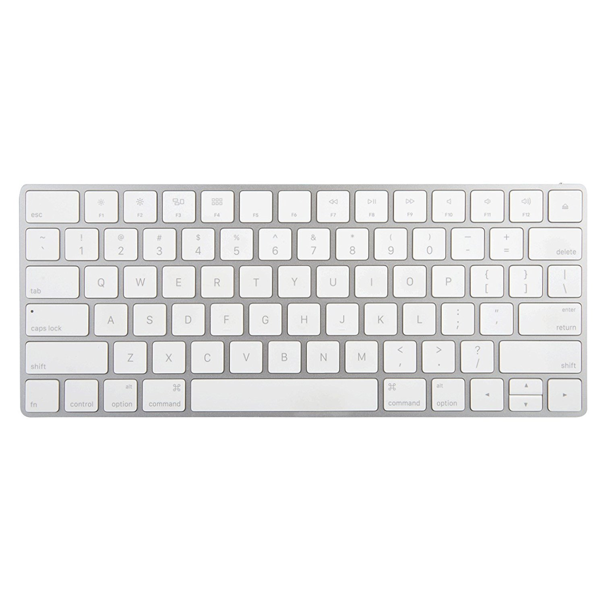
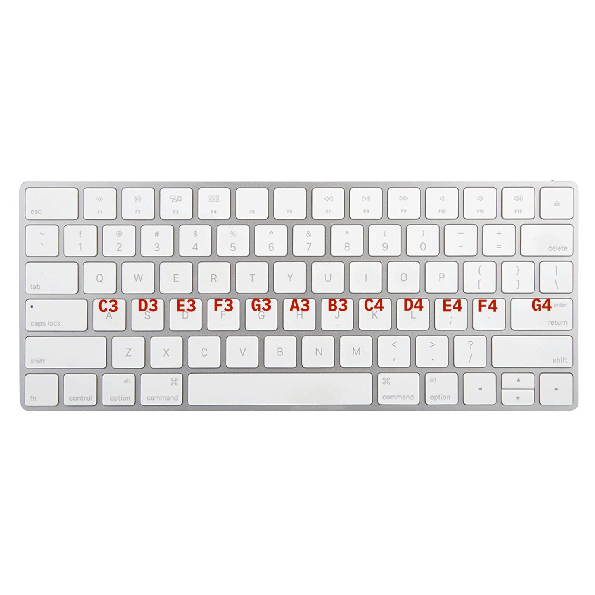

# MIDI emulator using Python

If you don't know what a MIDI keyboard is, google that up.

The goal of this program is to emulate the above with my current keyboard:

## What to do

- [x] Piano-ish layer (in version `1.0 - alpha`)
- [ ] Drum layer
- [ ] Metronome

## Work in progress

